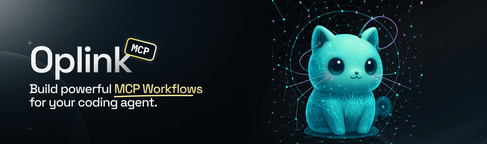
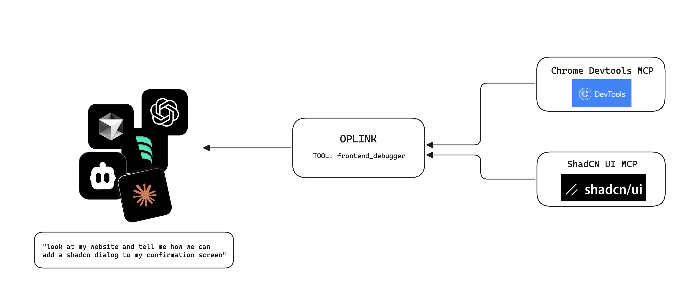

# Oplink




Create your own no-code workflows with MCP apps. Oplink combines multiple MCP servers into unified workflows that you define in simple YAML files.

✨ **Why Oplink?**
<br /><br />
🚀 *No-code agent workflows* — create your own agent workflows with just editing yaml files<br />
🧩 *One endpoint, many servers* — bundle any MCP Server like Chrome DevTools, shadcn, Context7, etc. behind a single MCP server entry.<br />
🛡️ *Guided prompts & schemas* — every workflow exposes typed parameters, instructions, and curated helper tools.<br />
🧠 *Works in any MCP client* — Cursor, Claude Code, Codex, Windsurf, and friends can run complex flows without custom glue code.<br /><br />

Imagine you're debugging a frontend issue and need to:
- **Chrome DevTools** to inspect the browser, capture screenshots, and analyze network requests
- **shadcn** to understand component APIs and get the latest library documentation



Without Oplink, you'd need to manually coordinate between multiple MCP servers, switching contexts and piecing together results. With Oplink, you define a single `frontend_debugging` workflow that orchestrates both servers in one call.

## Overview

Oplink transforms YAML-based workflow definitions into executable MCP tools. Unlike tools that only reference tool names in prompts, Oplink can actually execute external MCP tools that you wire in via a lightweight registry (`.mcp-workflows/servers.json`).

**Oplink combines multiple MCP servers into unified workflows.** Define prompts and tool sequences in YAML, wire in external MCP servers via a simple registry, and expose everything as a single MCP tool that works in any MCP client (Cursor, Claude, Windsurf, etc.).

### Example: Frontend Debugging Workflow

```yaml
frontend_debugging:
  description: "Debug frontend issues using Chrome DevTools and shadcn components"
  prompt: |
    Analyze the reported issue systematically.
    Use Chrome DevTools to inspect the browser state and capture diagnostics.
    Reference shadcn component documentation to understand the UI library.
  tools: "chrome-devtools:take_screenshot, chrome-devtools:list_console_messages, shadcn:search_items_in_registries"
```

One workflow, multiple servers, seamless execution. That's why Oplink exists.

## Installation

```bash
npx -y oplink@latest init
```

### Cursor Configuration

```json
{
  "mcpServers": {
    "oplink-get-docs": {
      "command": "npx",
      "args": [
        "oplink@latest",
        "server",
        "--config",
        "examples/deepwiki-demo/.mcp-workflows"
      ]
    },
    "oplink-frontend-debugging": {
      "command": "npx",
      "args": [
        "oplink@latest",
        "server",
        "--config",
        "examples/frontend-mcp-demo/.mcp-workflows"
      ],
      "env": {
        "FRONTEND_ROOT": "/path/to/oplink/examples/frontend-mcp-demo"
      }
    }
  }
}
```

### Custom Configuration

```json
{
  "mcpServers": {
    "oplink": {
      "command": "npx",
      "args": [
        "oplink@latest",
        "server",
        "--config",
        "/path/to/.workflows",
        "--preset",
        "thinking,coding"
      ]
    }
  }
}
```

## Configuration

Create a `.workflows` or `.mcp-workflows` directory and add YAML workflow files:

```yaml
debug_workflow:
  description: "Debug application issues"
  prompt: |
    Analyze the issue systematically.
    Gather logs and error information.
  toolMode: "situational"
  tools: "analyzeLogs, checkErrors, validateConfig"
```

### MCP Server Registry

External tools are resolved through `.mcp-workflows/servers.json`. Each entry maps a friendly alias to an MCP server definition (stdio command or HTTP endpoint). Use `${ENV_VAR}` placeholders for secrets. When you run with `--config <dir>`, Oplink auto‑loads `.env` files from that directory before expanding placeholders (precedence: shell > `.env.{NODE_ENV}.local` > `.env.{NODE_ENV}` > `.env.local` > `.env`). You do not need a `mcporter.json` for Oplink to run.

```json
{
  "servers": {
    "context7": {
      "type": "stdio",
      "command": "npx",
      "args": ["-y", "@upstash/context7-mcp"],
      "env": { "CONTEXT7_TOKEN": "${CONTEXT7_TOKEN}" }
    },
    "grafana": {
      "type": "http",
      "url": "https://grafana.example.com/mcp",
      "headers": { "Authorization": "Bearer ${GRAFANA_TOKEN}" }
    }
  }
}
```

The alias (`context7`, `grafana`, etc.) becomes the `server` prefix when you reference an external tool inside a scripted workflow step (for example, `chrome-devtools:take_screenshot`). Startup fails if an alias referenced in your workflows is missing, the registry is malformed, or an environment placeholder cannot be resolved.

See `examples/context7-demo/` (Context7) and `examples/deepwiki-demo/` (DeepWiki) for ready-to-run setups that wire real MCP servers into Oplink via this registry + workflow pair.

### Auto Workflows (zero config)

To expose an MCP server without writing custom steps, declare a workflow with `externalServers`. Oplink now exposes one tool per workflow **and** ships a built-in `describe_tools` helper so agents can dynamically discover the proxied commands. The recommended flow is:

1. Call `describe_tools({ "workflow": "frontend_debugger" })` to retrieve the cached catalog (names, descriptions, JSON schemas, last refresh time).
2. Pick a tool from the response and invoke the workflow with `{ "tool": "name", "args": { ... } }`.

Every auto workflow prompt automatically appends a reminder to run `describe_tools` first, so you don't have to mention it manually—though you can still customize the prompt text if you want to provide extra context.

```yaml
frontend_debugger:
  description: "Chrome DevTools helper"
  prompt: |
    Use Chrome DevTools MCP tools (e.g., take_screenshot, list_network_requests).
    Provide {"tool": "name", "args": { ... }} when calling this workflow.
  externalServers:
    - chrome-devtools

shadcn_helper:
  description: "shadcn helper"
  prompt: |
    Use shadcn MCP tools to list/search components.
  externalServers:
    - shadcn

full_helper:
  description: "Chrome DevTools + shadcn"
  prompt: |
    Access Chrome DevTools and shadcn MCP tools from one workflow.
  externalServers:
    - chrome-devtools
    - shadcn
```

Call the workflow with:

- `tool`: the tool name (e.g., `take_screenshot` or `chrome-devtools:take_screenshot`).
- `server`: optional unless you configured multiple aliases (like `full_helper`) and didn’t prefix the tool.
- `args`: arguments object forwarded to the MCP tool.

```json
describe_tools({
  "workflow": "frontend_debugger"
})

frontend_debugger({
  "tool": "take_screenshot",
  "args": {
    "url": "https://example.com",
    "format": "png"
  }
})
```

`describe_tools` accepts optional filters such as `aliases`, `search`, `limit`, and `refresh`. Set `refresh: true` if you need to force a re-discovery after changing the upstream MCP server. Use auto workflows for quick wiring, then switch to scripted workflows (below) when you need curated flows, defaults, or multi-step orchestration.

### Scripted Workflow Steps

Modern Oplink workflows run entirely on the server: you declare the external steps to execute, and the MCP client only sees the high-level tool (e.g., `frontend_debugger`). Each step references an external MCP tool using the `alias:tool` format from `servers.json` and can template arguments from workflow parameters.

```yaml
take_screenshot:
  description: "Capture screenshots for docs or testing"
  runtime: scripted
  parameters:
    url:
      type: string
      required: true
    wait_for:
      type: string
      description: "Optional text to wait for"
    format:
      type: string
      enum: [png, jpeg, webp]
      default: png
  steps:
    - call: chrome-devtools:navigate_page
      args:
        type: url
        url: "{{ url }}"
        ignoreCache: false
    - call: chrome-devtools:wait_for
      requires: wait_for
      args:
        text: "{{ wait_for }}"
        timeout: 10000
    - call: chrome-devtools:take_screenshot
      args:
        fullPage: true
        format: "{{ format }}"
```

- `runtime: scripted` tells Oplink to execute these steps server-side via mcporter.
- `requires` skips the step unless the named parameter (or saved value) is truthy.
- Arguments can use `{{ paramName }}` templating.
- Only the workflow tool (`take_screenshot`) is exposed to the MCP client; the chrome-devtools helpers stay internal.
- Defaulted parameters like `format` keep the happy path simple (no extra args) while allowing overrides when you need a different image type.
- Add `quiet: true` to a step if you don’t want the runner to emit "Step X" logs for that call (useful for screenshot steps that already return binary content).

Prompt-driven workflows (with `prompt`, `tools`, and `toolMode`) still work for legacy setups, but scripted workflows are the new default for minimizing context exposure.

### Parameter Injection

Inject typed parameters into prompts:

```yaml
thinking_mode:
  description: "Reflect on thoughts"
  parameters:
    thought:
      type: "string"
      description: "The thought to reflect upon"
      required: true
    context:
      type: "string"
      description: "Additional context"
  prompt: |
    Deeply reflect upon: {{ thought }}
    Consider this context: {{ context }}
    Analyze implications and tradeoffs.
```

### Advanced Tool Configuration

Define tool-specific prompts and optional flags:

```yaml
analysis_workflow:
  description: "Comprehensive analysis"
  prompt: "Begin analysis"
  toolMode: "sequential"
  tools:
    gather_data: "Collect relevant information"
    analyze_data:
      prompt: "Perform deep analysis"
      optional: false
    generate_report:
      prompt: "Create summary report"
      optional: true
```

## Preset Workflows

### Thinking

- **Thinking Mode**: Structured reflection and analysis
- **Deep Thinking Mode**: Multi-perspective comprehensive analysis

### Coding

- **Debugger Mode**: Systematic debugging with hypothesis testing
- **Architecture Mode**: System design with tradeoff analysis
- **Planner Mode**: Code change planning with codebase analysis
- **PRD Mode**: Product requirements documentation
- **Save Note**: Progress tracking and documentation

### GitHub

- **PR Review Mode**: Comprehensive pull request analysis
- **PR Creation Mode**: Structured PR creation workflow
- **Create Branch**: Contextual branch naming
- **Save Changes**: Git commit and push workflow

## External Tool Integration

Oplink uses mcporter under the hood to connect to external MCP servers, but it reads the registry from `.mcp-workflows/servers.json` in your chosen `--config` directory.
1. Define servers in `.mcp-workflows/servers.json` (see the examples above)
2. Reference tools as `server:tool` inside scripted workflow steps
3. Only the workflow tools themselves are exposed to the MCP client; helper tools remain internal

**Tool Call Flow:**
```
MCP Client → Oplink → mcporter Runtime → External MCP Server → Result
```

External tools are discovered at startup, cached with schema hashes, and exposed through the `describe_tools` helper instead of flooding the MCP client with dozens of proxied commands. The cache automatically refreshes when it expires, and you can trigger a manual refresh by calling `describe_tools({ "workflow": "name", "refresh": true })` if the upstream server changes.

See also:
- Advanced: How Oplink Uses mcporter → `docs/oplink-docs/content/5.advanced/3-mcporter.md`
- Advanced: Auth for External MCP Servers (API Key, OAuth) → `docs/oplink-docs/content/5.advanced/4-authentication.md`

### Connecting to hosted MCP servers (OAuth)

Hosted providers like Linear expose MCP servers over HTTPS/SSE and expect an OAuth flow. mcporter 0.4+ already handles the browser/device dance, so you just need one config entry per server:

```json
"linear": {
  "type": "stdio",
  "command": "npx",
  "args": ["-y", "mcp-remote", "https://mcp.linear.app/mcp"],
  "auth": "oauth",
  "clientName": "oplink-linear-demo",
  "oauthRedirectUrl": "http://127.0.0.1:43115/callback",
  "tokenCacheDir": "./.tokens/linear",
  "env": {
    "MCP_REMOTE_CLIENT_ID": "${LINEAR_CLIENT_ID}",
    "MCP_REMOTE_CLIENT_SECRET": "${LINEAR_CLIENT_SECRET}"
  }
}
```

Notes:

1. `type: "stdio"` + `npx mcp-remote` lets Oplink spawn the hosted server even though it lives on HTTPS.
2. mcporter caches refresh tokens under `tokenCacheDir`, so the OAuth prompt only happens once.
3. Skip the client ID/secret prompts if you prefer dynamic registration—mcporter will open a browser during the first tool call.
4. Run `pnpm bootstrap:linear` to copy the example config and (optionally) inject your credentials into `examples/linear-discord-demo/.mcp-workflows/servers.json`.

To inspect the tools exposed by any alias, reuse the same config directory:

```bash
npx mcporter list linear --config examples/linear-discord-demo/.mcp-workflows

For Discord in the demo, export `DISCORD_BOT_TOKEN` in your shell; Oplink maps it to `DISCORD_TOKEN` for the MCP server defined in `examples/linear-discord-demo/.mcp-workflows/servers.json`.
```

## Requirements

- Node.js 18+ or 20+
- Optional: mcporter CLI for local inspection (`npx mcporter list <alias> --config path/to/.mcp-workflows`)
- MCP client (Cursor, Claude Desktop, etc.)

## Troubleshooting

- Missing `FRONTEND_ROOT` (shadcn): set `export FRONTEND_ROOT=$(pwd)/examples/frontend-mcp-demo` or set it under your MCP client entry's `env` block.
- Chrome won’t launch: ensure Chrome is installed and starts locally. For remote/debugging Chrome, launch it separately and update the Chrome DevTools server flags per its docs.
- No tools appear: confirm `--config` points to the intended `.mcp-workflows` directory and your IDE picked up the MCP server entry.
- Tool catalog looks stale: run `describe_tools({ "workflow": "name", "refresh": true })` to force a re-discovery after changing the upstream MCP server.

## Development

```bash
# Install dependencies
pnpm install

# Build packages
pnpm build

# Run tests
pnpm test

# Start development server
cd packages/oplink
pnpm dev
```

## Definition

Oplink is an MCP server that orchestrates workflows by combining prompts with external MCP tool execution. It bridges your workflow definitions with mcporter-configured MCP servers, enabling automatic tool discovery and execution.

## Credits

- Initial idea inspired by [mcpn](https://github.com/regenrek/mcpn), developed in collaboration with [@tedjames](https://github.com/tedjames)
- Using [mcporter](https://github.com/steipete/mcporter) code-generation toolkit for mcp by [@steipete](https://github.com/steipete)

## License

MIT

## Repository

https://github.com/instructa/oplink
- Chrome DevTools screenshot errors: if a workflow calls `chrome-devtools:take_screenshot` without specifying `format`, DevTools rejects the request. The provided examples set a default (`png`) and let you override it via the `format`/`screenshot_format` parameter.
