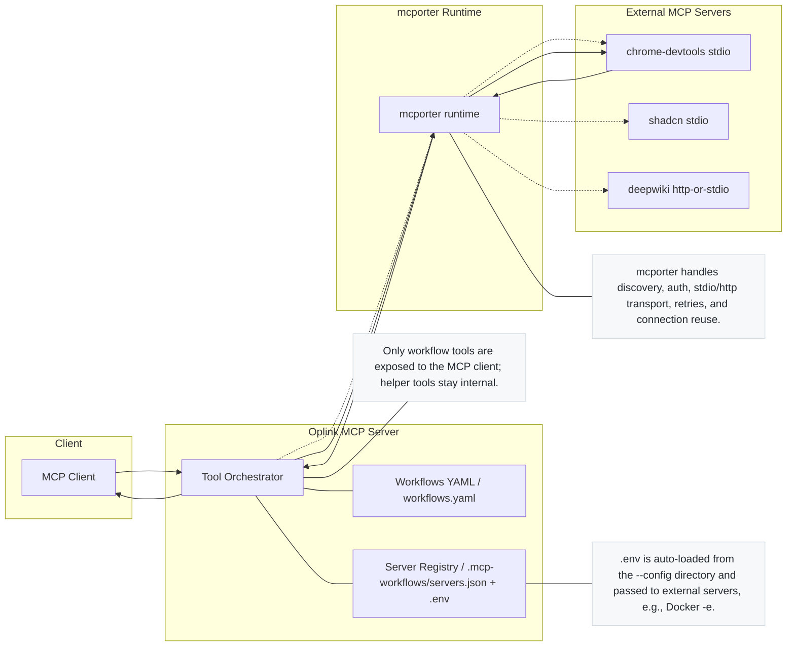

# Oplink Architecture (Mermaid)

The diagram illustrates how a workflow runs end‑to‑end: an IDE (MCP client) invokes an Oplink workflow (prompt + schema), the Oplink tool orchestrator executes local/proxy tools, and mcporter bridges calls to external MCP servers (Chrome DevTools, shadcn, DeepWiki, etc.). Results stream back to Oplink, which aggregates and returns a response to the client.

## Execution Steps

1. The MCP client invokes an Oplink workflow with parameters.
2. Oplink loads workflow definitions and the external server registry in the selected `--config` directory.
3. At startup, Oplink validates the scripted steps and loads the required external tool schemas via mcporter.
4. When the prompt calls a tool, Oplink forwards the request to mcporter.
5. mcporter launches/connects to the external MCP server and executes the tool.
6. Results stream back to Oplink, which aggregates them and returns the final response to the MCP client.

## Configuration & Environment

- Single source of truth: external MCP servers live in `.mcp-workflows/servers.json`. Place `.env` next to it; Oplink auto‑loads it when started with `--config <dir>`.
- IDEs (Cursor, Windsurf, etc.) should point only to the Oplink stdio server; do not duplicate external servers in IDE config.
- For Atlassian:
  - Cloud uses `JIRA_USERNAME` + `JIRA_API_TOKEN` (and Confluence equivalents).
  - Server/Data Center uses `JIRA_PERSONAL_TOKEN` (and `CONFLUENCE_PERSONAL_TOKEN`); set optional `*_SSL_VERIFY=false` for self‑signed certs.

## Workflow Shapes (Schema)

The schema defines three explicit shapes (runtime optional):
- Scripted: requires `steps`, disallows `externalServers`. Step keys: `call`, `args`, `saveAs`, `requires`, `quiet`.
- External: requires `externalServers` + `prompt`, disallows `steps`.
- Prompt‑only: requires `prompt`, disallows `steps` and `externalServers`.

This eliminates editor warnings and keeps authoring simple.

## Error Handling & Suggestions

- Unknown tool names include "Did you mean …" suggestions (uFuzzy) from the live catalog.
- External call errors include alias:tool context and step index (for scripted flows).

## Caching & Reproducibility (Planned)

- Discovery cache persists across runs; doctor/verify commands and a catalog lockfile ensure reproducible catalogs and fast startup at scale.
